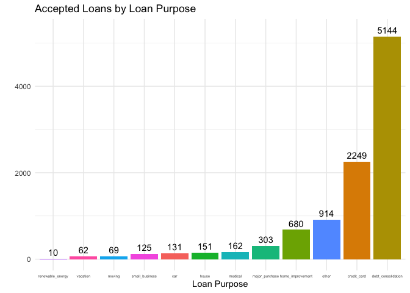
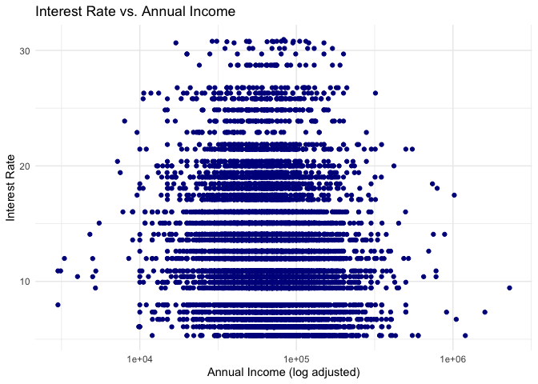
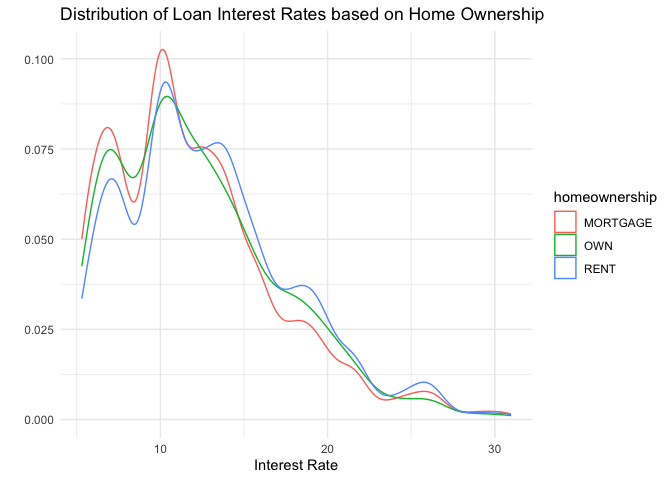
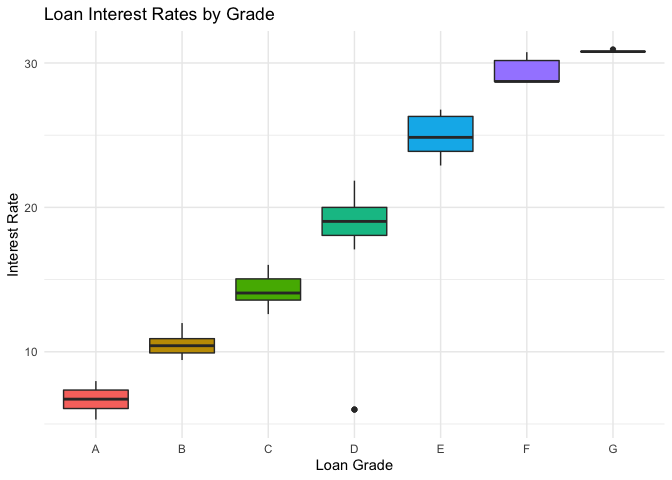
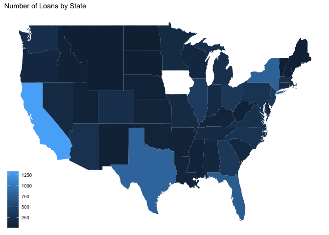
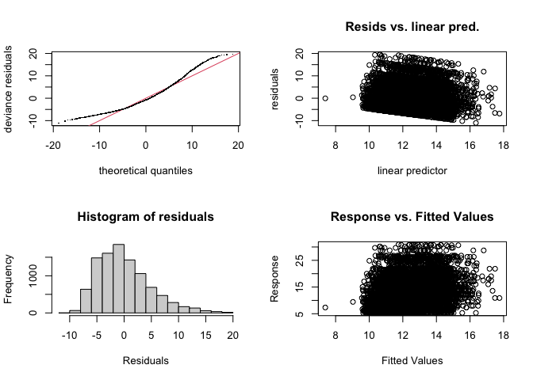
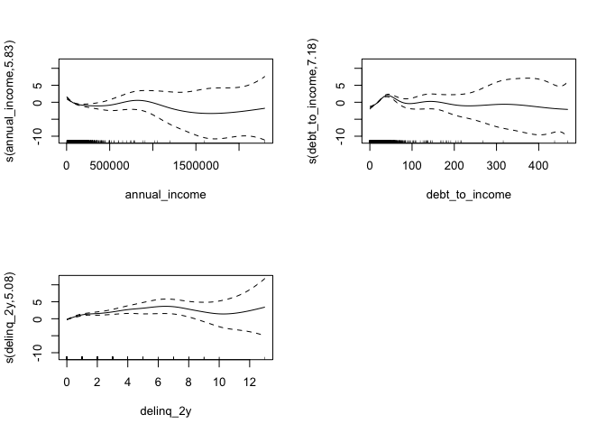

## Setup


```r
# load packages
library(tidyverse)
library(ggthemes)
library(ggmap)
library(tidymodels)
library(readr)
theme_set(theme_minimal())
tidymodels_prefer()
```


```r
# read in data
loans <- read_csv("loans_full_schema.csv")
```

## Description and Issues

This data set contains loans made through the platform Lending Club. Each row represents a loan that was successfully made from one individual to another. The columns contain various information regarding the loan applicant and the loan itself. The only minor issue I see with the data set is the abundance of NA values due to the specificity of many of the columns.

## Visualizations and Observations


```r
loans %>%
  group_by(loan_purpose) %>%
  mutate(loan_purpose_count = n()) %>%
  select(loan_purpose, loan_purpose_count) %>%
  unique() %>%
  ggplot(aes(x = fct_reorder(loan_purpose, loan_purpose_count), y = loan_purpose_count, fill = loan_purpose, label = loan_purpose_count)) +
  geom_col() +
  geom_text(nudge_y = 150) +
  labs(x = "Loan Purpose", y = "", title = "Accepted Loans by Loan Purpose") +
  theme(legend.position = "none", axis.text.x = element_text(size = 4.5))
```

<!-- -->

Bar chart of accepted loans by loan purpose. There are the most loans for debt consolidation followed by credit card and the least for renewable energy.


```r
loans %>%
  filter(annual_income > 10) %>%
  ggplot(aes(x = annual_income, y = interest_rate)) +
  geom_point(color = "darkblue") +
  scale_x_log10() +
  labs(x = "Annual Income (log adjusted)", y = "Interest Rate", title = "Interest Rate vs. Annual Income")
```

<!-- -->

Plot of interest rate vs. annual income. There appears to be no obvious correlation between income and interest rate, except that the distribution of incomes seems to be tighter for higher interest rate loans.


```r
loans %>%
  ggplot(aes(x = interest_rate, color = homeownership)) +
  geom_density() +
  labs(x = "Interest Rate", y = "", title = "Distribution of Loan Interest Rates based on Home Ownership")
```

<!-- -->

Density plot of loan interest rates based on home ownership. Generally, interest rates are similar for all types of home ownership, however there are slightly more low interest rate loans for applicants who mortgage or own their house and slightly more high interest loans for applicants who rent their house.


```r
loans %>%
  ggplot(aes(x = grade, y = interest_rate, fill = grade)) +
  geom_boxplot() +
  labs(x = "Loan Grade", y = "Interest Rate", title = "Loan Interest Rates by Grade") +
  theme(legend.position = "none")
```

<!-- -->

Box plot of loan interest rates by grade. The lower the interest rate on the loan, the better the grade the loan receives.


```r
states_map <- map_data("state")

loans %>%
  mutate(state_name = state.name[match(state, state.abb)]) %>%
  mutate(state_name = str_to_lower(state_name)) %>%
  filter(is.na(state_name)==FALSE) %>%
  group_by(state_name) %>%
  mutate(state_count = n()) %>%
  select(state_name, state_count) %>%
  unique() %>%
  ggplot() +
  geom_map(map = states_map, aes(map_id = state_name, fill = state_count)) +
  expand_limits(x = states_map$long, y = states_map$lat) + 
  theme_map() +
  labs(title = "Number of Loans by State") +
  theme(legend.title = element_blank())
```

<!-- -->

Map of the number of loans by state. California appears to have the most loans, followed by Texas, New York, and Florida.

## Modeling Interest Rate

### Linear Regression with Cross-Validation


```r
set.seed(1)

# linear regression model spec
lm_spec <-
    linear_reg() %>% 
    set_engine(engine = 'lm') %>% 
    set_mode('regression')

# cross-validation folds
loans_cv <- vfold_cv(loans, v = 10)
```


```r
# workflow
mod1_wf <- workflow() %>%
  add_formula(interest_rate ~ annual_income + debt_to_income + delinq_2y) %>%
  add_model(lm_spec)

# cross-validate with workflow
mod1_cv <- fit_resamples(mod1_wf, resamples = loans_cv, metrics = metric_set(rmse, rsq, mae))
```


```r
mod1_cv %>% collect_metrics()
```

<div data-pagedtable="false">
  <script data-pagedtable-source type="application/json">
{"columns":[{"label":[".metric"],"name":[1],"type":["chr"],"align":["left"]},{"label":[".estimator"],"name":[2],"type":["chr"],"align":["left"]},{"label":["mean"],"name":[3],"type":["dbl"],"align":["right"]},{"label":["n"],"name":[4],"type":["int"],"align":["right"]},{"label":["std_err"],"name":[5],"type":["dbl"],"align":["right"]},{"label":[".config"],"name":[6],"type":["chr"],"align":["left"]}],"data":[{"1":"mae","2":"standard","3":"3.86986374","4":"10","5":"0.034542331","6":"Preprocessor1_Model1"},{"1":"rmse","2":"standard","3":"4.91116207","4":"10","5":"0.043577453","6":"Preprocessor1_Model1"},{"1":"rsq","2":"standard","3":"0.03792391","4":"10","5":"0.004790489","6":"Preprocessor1_Model1"}],"options":{"columns":{"min":{},"max":[10]},"rows":{"min":[10],"max":[10]},"pages":{}}}
  </script>
</div>

### GAMs


```r
set.seed(1)

# gam model spec
gam_spec <- gen_additive_mod() %>%
  set_engine(engine = 'mgcv') %>%
  set_mode('regression') 

# fitting gam model
gam_mod <- fit(gam_spec, interest_rate ~ s(annual_income) + s(debt_to_income) + s(delinq_2y), data = loans)
```


```r
par(mfrow=c(2,2))
gam_mod %>% pluck('fit') %>% 
  mgcv::gam.check() 
```

<!-- -->

```
## 
## Method: GCV   Optimizer: magic
## Smoothing parameter selection converged after 4 iterations.
## The RMS GCV score gradient at convergence was 3.993287e-05 .
## The Hessian was positive definite.
## Model rank =  28 / 28 
## 
## Basis dimension (k) checking results. Low p-value (k-index<1) may
## indicate that k is too low, especially if edf is close to k'.
## 
##                     k'  edf k-index p-value
## s(annual_income)  9.00 5.83    0.99    0.23
## s(debt_to_income) 9.00 7.18    0.99    0.18
## s(delinq_2y)      9.00 5.08    1.00    0.51
```


```r
gam_mod %>% pluck('fit') %>% 
  plot(all.terms = TRUE, pages = 1)
```

<!-- -->

## Analysis

Overall, neither model is very accurate at predicting interest rate. The linear regression model with cross-validation has a very low R-squared value and the MAE and RMSE and quite high. For the GAMs model, our histogram of residuals is not symmetric and there is no correlation in the response vs. fitted values graph. Additionally, we see our estimated non-linear functions for each variable have quite a bit of error as each variable increases.

Our linear regression model assumes a linear relationship between the predictor and outcome variables. While GAMs no longer assumes a linear relationship, the relationship between predictor variables is still assumed to be additive.

There are many ways to enhance and improve upon both these models. Using a different set of predictor variables for our models could show more predicting power. Additionally, doing cross-validation with the GAMs model. With more time, I would explore using different model types like LASSO or non-parametric models like KNN with the previous enhancements as well. Furthermore, my approach to choosing the variables for the model were solely based off of my own intuition on what I thought would predict interest rate, however, with more time, I could analyze variable importance using LASSO or subset selection to make a more refined model.
